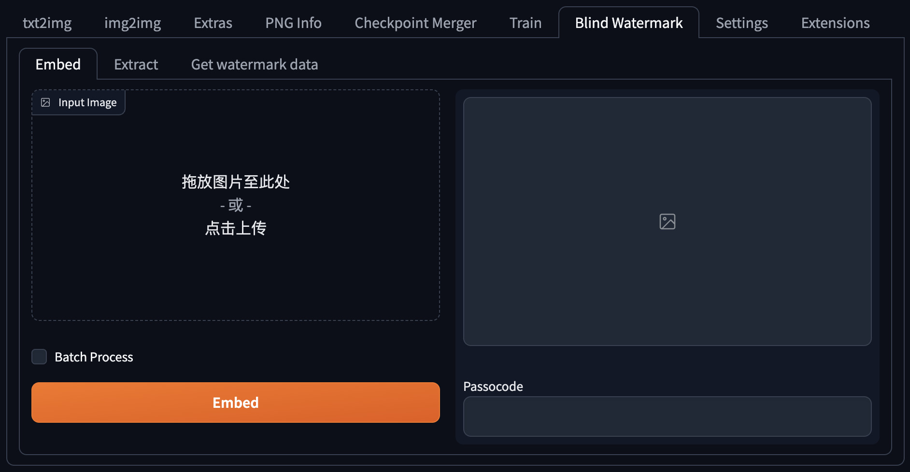

# SD Blind Watermark
[[中文版]](./README_zh.md)  
Embed custom blind watermark into your images  

## Screenshot
  

## Usage
This plugin allows you to embed invisible watermarks into your images manually or automatically after image generation.  

Before using it for the first time, please go to `Blind Watermark`>`Get watermark data` tab, and drag the 64*64 pixel watermark image into the image box. Then copy the obtained data text to `Settings`>`BlindWatermark`>`Watermark data` and save.  

If you enable `Automatically embed the watermark after generation`, it is recommended to enable `Make SD Blind Watermark run after any other extensions` at the same time to prevent other plug-ins from destroying the watermark.  

Each picture will be encrypted with a randomly generated Passcode, **please do not tell anyone the Passcode of the image, it is the only way to read the watermark from the image!!!**  

## Install
1. Go to SD WebUI's `extension` tab
2. Click `Install from URL` subtab
3. Paste `https://github.com/lihaoyun6/sd-webui-Blind-Watermark` into the URL textbox
4. Click `Install` and wait for it to complete
5. Once completed, the WebUI needs to be reloaded

## Credits
- [BlindWatermark](https://github.com/fire-keeper/BlindWatermark) @darksouls4  
- [Stable Diffusion web UI](https://github.com/AUTOMATIC1111/stable-diffusion-webui) @AUTOMATIC1111  
